## 面积图

### 基础面积图

```html
<html lang="en">
<head>
    <meta charset="UTF-8">
    <title>基础面积图</title>

    <script src="./js/echarts.js"></script>

</head>

<style>
    #container {
        width: 70vw;
        height: 70vh;
        position: absolute;
        top: 50%;
        left: 50%;
        transform: translate(-50%, -50%);
    }
</style>
<body>
<div id="container"></div>
<script>
    //初始化echarts实例
    var chart = echarts.init(document.getElementById('container'));

    // 指定图表的配置项和数据
    var option =
        {
            xAxis: {
                type: 'category',
                boundaryGap: false,
                data: ['Mon', 'Tue', 'Wed', 'Thu', 'Fri', 'Sat', 'Sun']
            },
            yAxis: {
                type: 'value'
            },
            series: [
                {
                    data: [820, 932, 901, 934, 1290, 1330, 1320],
                    type: 'line',
                    areaStyle: {}
                }
            ]
        };

    //使用刚指定的配置项和数据显示图表
    chart.setOption(option);

</script>

</body>
</html>
```


与基础折线图相比，多了`areaStyle: {}`


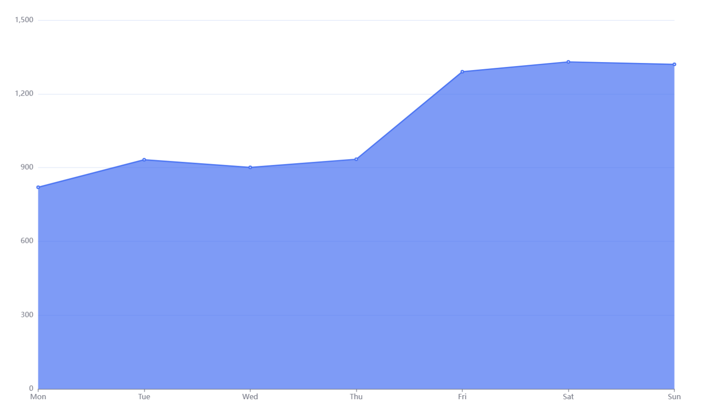


### 堆叠面积图

```html
<html lang="en">
<head>
    <meta charset="UTF-8">
    <title>堆叠面积图</title>

    <script src="./js/echarts.js"></script>

</head>

<style>
    #container {
        width: 70vw;
        height: 70vh;
        position: absolute;
        top: 50%;
        left: 50%;
        transform: translate(-50%, -50%);
    }
</style>
<body>
<div id="container"></div>
<script>
    //初始化echarts实例
    var chart = echarts.init(document.getElementById('container'));

    // 指定图表的配置项和数据
    var option =
        {
            xAxis: {
                type: 'category',
                boundaryGap: false,
                data: ['Mon', 'Tue', 'Wed', 'Thu', 'Fri', 'Sat', 'Sun']
            },
            yAxis: {
                type: 'value'
            },
            tooltip: {
                trigger: 'axis',
                axisPointer: {
                    type: 'cross',
                    label: {
                        backgroundColor: '#6a7985'
                    }
                }
            },
            legend: {
                data: ["面积图1", "面积图2", "面积图3"]
            },
            grid: {
                left: '3%',
                right: '4%',
                bottom: '3%',
                containLabel: true
            },
            series: [
                {
                    data: (function ()
                    {
                        var data = [];
                        for (let i = 0; i < 7; i++)
                        {
                            data.push(Math.random())
                        }
                        return data;
                    }()),
                    type: 'line',
                    areaStyle: {},
                    emphasis: {
                        focus: 'series'
                    },
                    name: "面积图1"
                },
                {
                    data: (function ()
                    {
                        var data = [];
                        for (let i = 0; i < 7; i++)
                        {
                            data.push(Math.random())
                        }
                        return data;
                    }()),
                    type: 'line',
                    areaStyle: {},
                    emphasis: {
                        focus: 'series'
                    },
                    name: "面积图2"
                },
                {
                    data: (function ()
                    {
                        var data = [];
                        for (let i = 0; i < 7; i++)
                        {
                            data.push(Math.random())
                        }
                        return data;
                    }()),
                    type: 'line',
                    areaStyle: {},
                    emphasis: {
                        focus: 'series'
                    },
                    name: "面积图3"
                },
            ]
        };

    //使用刚指定的配置项和数据显示图表
    chart.setOption(option);

</script>

</body>
</html>
```


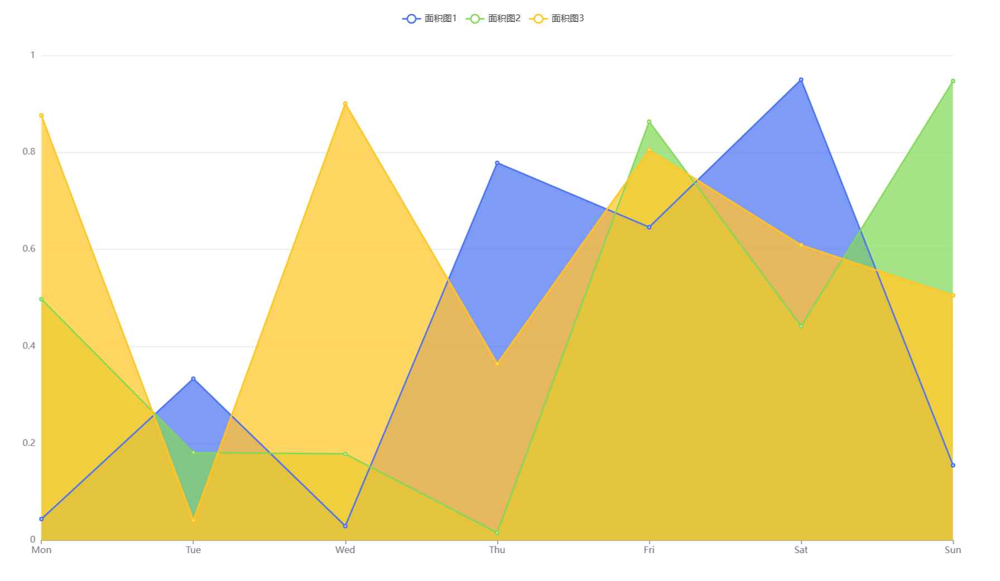


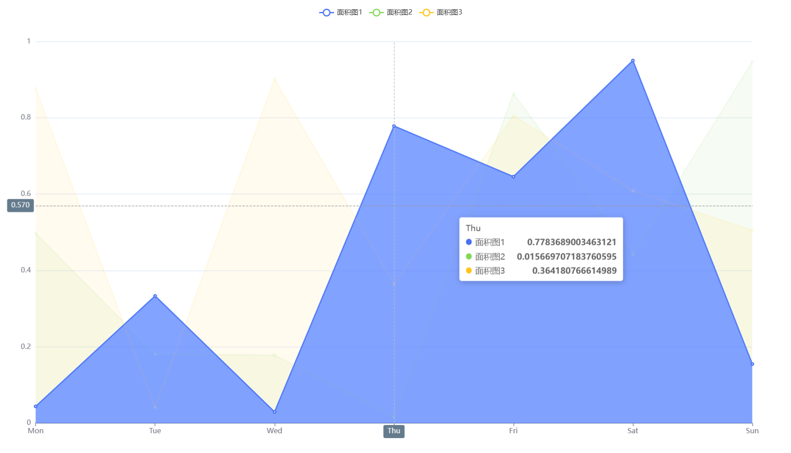


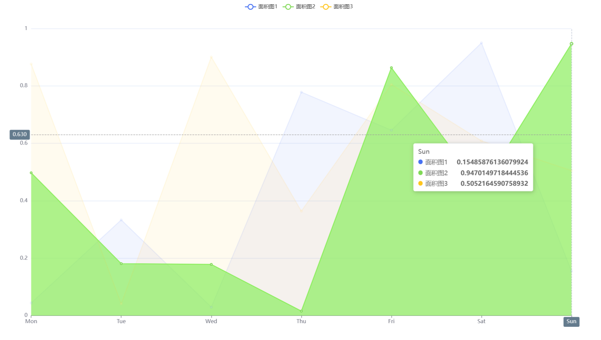


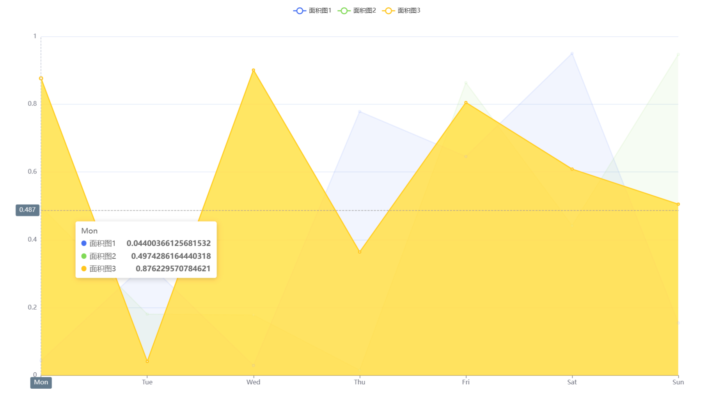


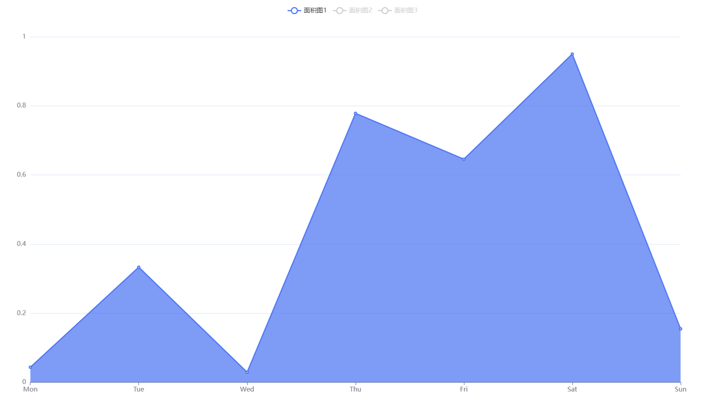


```html
<html lang="en">
<head>
    <meta charset="UTF-8">
    <title>堆叠面积图</title>

    <script src="./js/echarts.js"></script>

</head>

<style>
    #container {
        width: 70vw;
        height: 70vh;
        position: absolute;
        top: 50%;
        left: 50%;
        transform: translate(-50%, -50%);
    }
</style>
<body>
<div id="container"></div>
<script>
    //初始化echarts实例
    var chart = echarts.init(document.getElementById('container'));

    // 指定图表的配置项和数据
    var option =
        {
            title: {
                text: 'Stacked Area Chart'
            },
            tooltip: {
                trigger: 'axis',
                axisPointer: {
                    type: 'cross',
                    label: {
                        backgroundColor: '#6a7985'
                    }
                }
            },
            legend: {
                data: ['Email', 'Union Ads', 'Video Ads', 'Direct', 'Search Engine']
            },
            toolbox: {
                feature: {
                    saveAsImage: {}
                }
            },
            grid: {
                left: '3%',
                right: '4%',
                bottom: '3%',
                containLabel: true
            },
            xAxis: [
                {
                    type: 'category',
                    boundaryGap: false,
                    data: ['Mon', 'Tue', 'Wed', 'Thu', 'Fri', 'Sat', 'Sun']
                }
            ],
            yAxis: [
                {
                    type: 'value'
                }
            ],
            series: [
                {
                    name: 'Email',
                    type: 'line',
                    stack: 'Total',
                    areaStyle: {},
                    emphasis: {
                        focus: 'series'
                    },
                    data: [120, 132, 101, 134, 90, 230, 210]
                },
                {
                    name: 'Union Ads',
                    type: 'line',
                    stack: 'Total',
                    areaStyle: {},
                    emphasis: {
                        focus: 'series'
                    },
                    data: [220, 182, 191, 234, 290, 330, 310]
                },
                {
                    name: 'Video Ads',
                    type: 'line',
                    stack: 'Total',
                    areaStyle: {},
                    emphasis: {
                        focus: 'series'
                    },
                    data: [150, 232, 201, 154, 190, 330, 410]
                },
                {
                    name: 'Direct',
                    type: 'line',
                    stack: 'Total',
                    areaStyle: {},
                    emphasis: {
                        focus: 'series'
                    },
                    data: [320, 332, 301, 334, 390, 330, 320]
                },
                {
                    name: 'Search Engine',
                    type: 'line',
                    stack: 'Total',
                    label: {
                        show: true,
                        position: 'top'
                    },
                    areaStyle: {},
                    emphasis: {
                        focus: 'series'
                    },
                    data: [820, 932, 901, 934, 1290, 1330, 1320]
                }
            ]
        };

    //使用刚指定的配置项和数据显示图表
    chart.setOption(option);

</script>

</body>
</html>
```


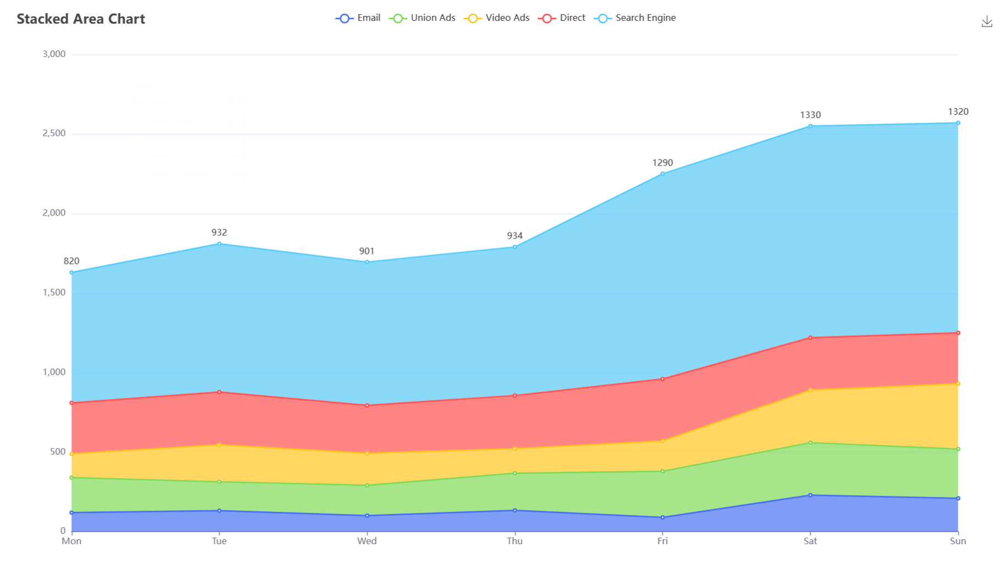


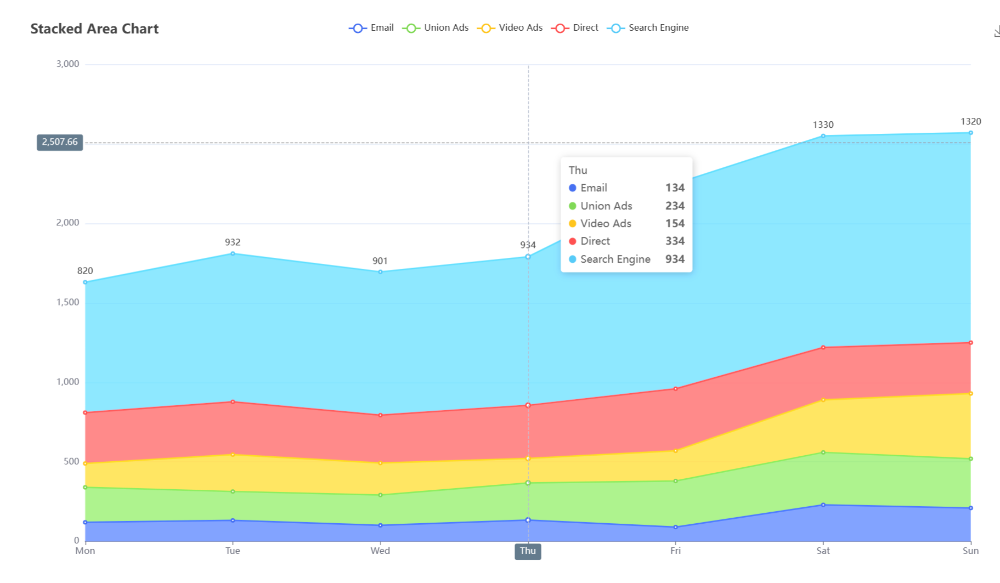


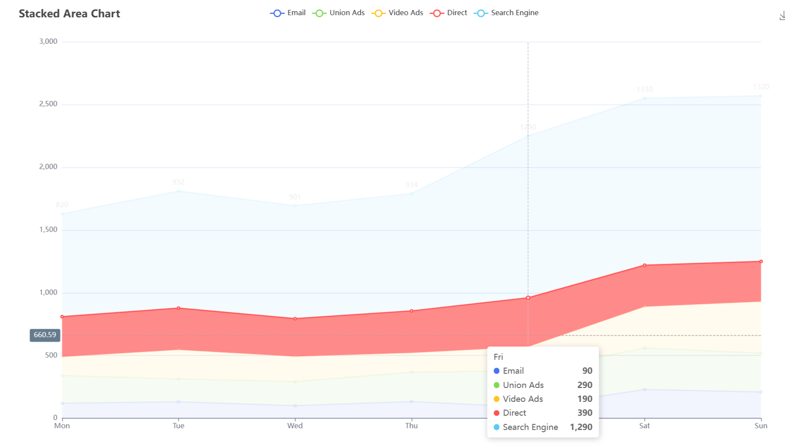


### 大数据量面积图

```html
<html lang="en">
<head>
    <meta charset="UTF-8">
    <title>大数据量面积图</title>

    <script src="./js/echarts.js"></script>

</head>

<style>
    #container {
        width: 70vw;
        height: 70vh;
        position: absolute;
        top: 50%;
        left: 50%;
        transform: translate(-50%, -50%);
    }
</style>
<body>
<div id="container"></div>
<script>
    //初始化echarts实例
    var chart = echarts.init(document.getElementById('container'));

    let base = +new Date(1968, 9, 3);
    let oneDay = 24 * 3600 * 1000;
    let date = [];
    let data = [Math.random() * 300];
    for (let i = 1; i < 20000; i++)
    {
        var now = new Date((base += oneDay));
        date.push([now.getFullYear(), now.getMonth() + 1, now.getDate()].join('/'));
        data.push(Math.round((Math.random() - 0.5) * 20 + data[i - 1]));
    }

    // 指定图表的配置项和数据
    var option =
        {
            tooltip: {
                trigger: 'axis',
                position: function (pt)
                {
                    return [pt[0], '10%'];
                }
            },
            title: {
                left: 'center',
                text: 'Large Area Chart'
            },
            toolbox: {
                feature: {
                    dataZoom: {
                        yAxisIndex: 'none'
                    },
                    restore: {},
                    saveAsImage: {}
                }
            },
            xAxis: {
                type: 'category',
                boundaryGap: false,
                data: date
            },
            yAxis: {
                type: 'value',
                boundaryGap: [0, '100%']
            },
            dataZoom: [
                {
                    type: 'inside',
                    start: 0,
                    end: 10
                },
                {
                    start: 0,
                    end: 10
                }
            ],
            series: [
                {
                    name: 'Fake Data',
                    type: 'line',
                    symbol: 'none',
                    sampling: 'lttb',
                    itemStyle: {
                        color: 'rgb(255, 70, 131)'
                    },
                    areaStyle: {
                        color: new echarts.graphic.LinearGradient(0, 0, 0, 1, [
                            {
                                offset: 0,
                                color: 'rgb(255, 158, 68)'
                            },
                            {
                                offset: 1,
                                color: 'rgb(255, 70, 131)'
                            }
                        ])
                    },
                    data: data
                }
            ]
        };

    //使用刚指定的配置项和数据显示图表
    chart.setOption(option);

</script>

</body>
</html>
```


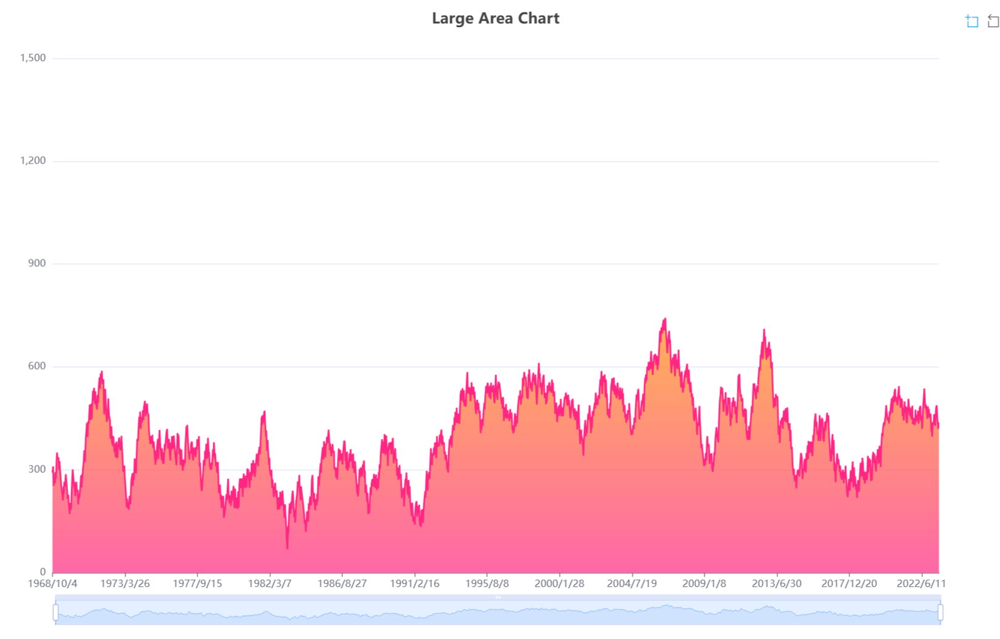


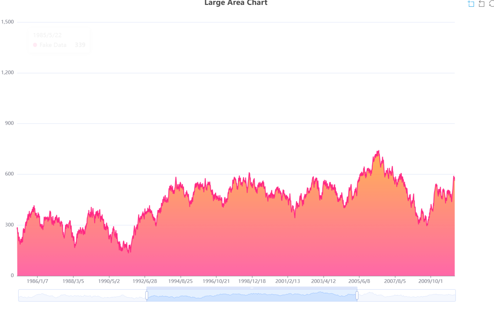


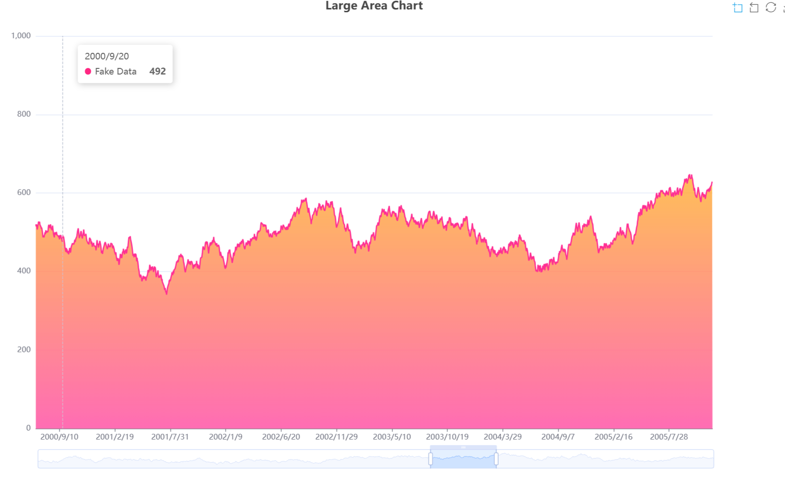


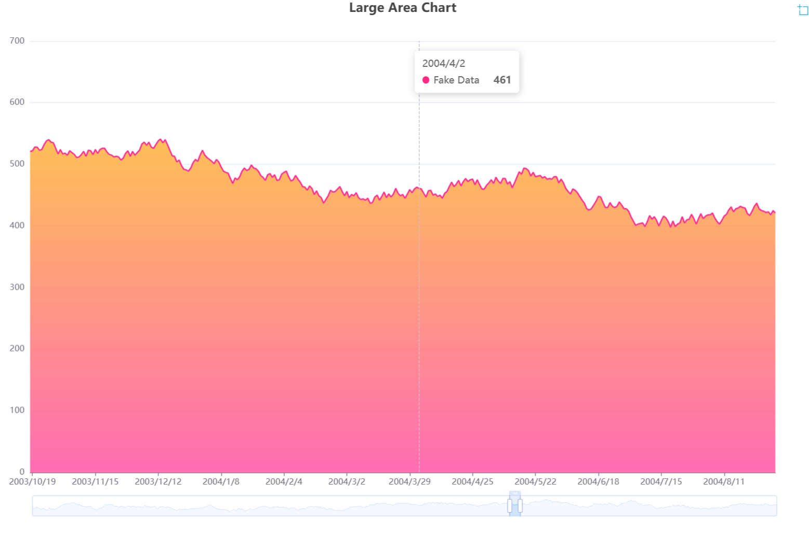


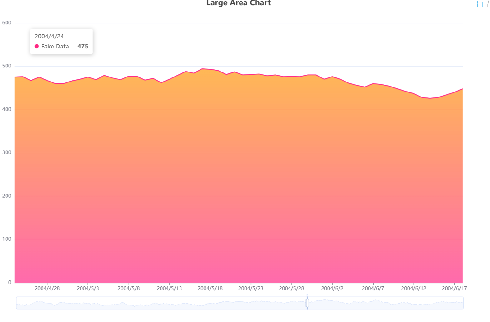


